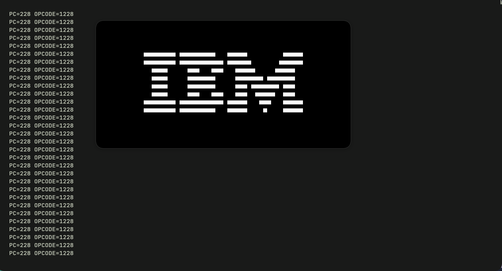

# CHIP-8 Emulator in Java

YET ANOTHER CHIP-8 emulator written from scratch in Java.

<p align="center">
  
</p>

## Features

### CPU

- 4 KB memory
- 16 general-purpose registers (`V0`–`VF`)
- Index register (`I`)
- Program Counter (`PC`)
- Fetch–Decode–Execute pipeline

### Graphics

- 64×32 monochrome framebuffer
- XOR sprite rendering
- Java Swing renderer

### ROM

- ROM loading at address `0x200`

---

## Implemented Instructions

| Opcode | Description | Status |
|:------:|-------------|:------:|
| `00E0` | Clear Display | ✅ |
| `1NNN` | Jump | ✅ |
| `6XNN` | Set Register | ✅ |
| `7XNN` | Add Immediate | ✅ |
| `ANNN` | Load Index Register | ✅ |
| `DXYN` | Draw Sprite | ✅ |

---

## Current Status

- ✅ Emulator initialization
- ✅ ROM loading
- ✅ Fetch cycle
- ✅ Opcode decoding
- ✅ Opcode execution
- ✅ Sprite rendering
- ✅ IBM Logo ROM

---

## TODO

### CPU

- [ ] Stack implementation
- [ ] Subroutine instructions (`2NNN`, `00EE`)
- [ ] Remaining CHIP-8 instruction set

### Input

- [ ] 16-key hexadecimal keypad

### Timers

- [ ] Delay Timer
- [ ] Sound Timer

### Compatibility

- [ ] CHIP-8 opcode test ROMs
- [ ] Pong
- [ ] Tetris
- [ ] Space Invaders

---

## Project Structure

```text
.
├── assets/
│   └── ibm-logo.png
├── Chip8.java
├── Display.java
├── Main.java
├── IBM Logo.ch8
├── README.md
└── general_info.txt
```

---

## Build

Compile:

```bash
javac *.java
```

Run:

```bash
java Main
```

---

## References

- Cowgod's CHIP-8 Technical Reference  
  http://devernay.free.fr/hacks/chip8/C8TECH10.HTM

- Tobias V. Langhoff — *Write a CHIP-8 Emulator*  
  https://tobiasvl.github.io/blog/write-a-chip-8-emulator/

- CHIP-8 (Wikipedia)  
  https://en.wikipedia.org/wiki/CHIP-8